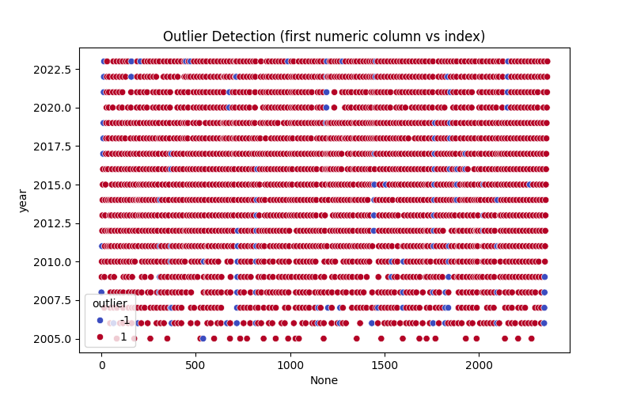

# Automated Data Analysis Report

## Data Overview

- Number of rows: 2363
- Number of columns: 10
- Column names and data types:

  - year: float64
  - Life Ladder: float64
  - Log GDP per capita: float64
  - Social support: float64
  - Healthy life expectancy at birth: float64
  - Freedom to make life choices: float64
  - Generosity: float64
  - Perceptions of corruption: float64
  - Positive affect: float64
  - Negative affect: float64

## Summary Statistics

### year
- count: 2363.0
- mean: 2014.7638595006347
- std: 5.059436468192803
- min: 2005.0
- 25%: 2011.0
- 50%: 2015.0
- 75%: 2019.0
- max: 2023.0
### Life Ladder
- count: 2363.0
- mean: 5.483565806178587
- std: 1.1255215132391931
- min: 1.281
- 25%: 4.647
- 50%: 5.449
- 75%: 6.3235
- max: 8.019
### Log GDP per capita
- count: 2363.0
- mean: 9.399671092077089
- std: 1.1452205633024595
- min: 5.527
- 25%: 8.52
- 50%: 9.492
- 75%: 10.382
- max: 11.676
### Social support
- count: 2363.0
- mean: 0.8093693617021276
- std: 0.12087774068835622
- min: 0.228
- 25%: 0.744
- 50%: 0.834
- 75%: 0.904
- max: 0.987
### Healthy life expectancy at birth
- count: 2363.0
- mean: 63.40182826086957
- std: 6.750773035270505
- min: 6.72
- 25%: 59.545
- 50%: 64.9
- 75%: 68.4
- max: 74.6
### Freedom to make life choices
- count: 2363.0
- mean: 0.750281908036098
- std: 0.1382909642726584
- min: 0.228
- 25%: 0.662
- 50%: 0.769
- 75%: 0.861
- max: 0.985
### Generosity
- count: 2363.0
- mean: 9.772129710780079e-05
- std: 0.15859623298729603
- min: -0.34
- 25%: -0.108
- 50%: -0.015
- 75%: 0.088
- max: 0.7
### Perceptions of corruption
- count: 2363.0
- mean: 0.7439709562109027
- std: 0.17990733468575265
- min: 0.035
- 25%: 0.696
- 50%: 0.79
- 75%: 0.864
- max: 0.983
### Positive affect
- count: 2363.0
- mean: 0.6518820008550663
- std: 0.10569858218603116
- min: 0.179
- 25%: 0.573
- 50%: 0.662
- 75%: 0.7364999999999999
- max: 0.884
### Negative affect
- count: 2363.0
- mean: 0.27315083084789094
- std: 0.08683546152117355
- min: 0.083
- 25%: 0.209
- 50%: 0.263
- 75%: 0.326
- max: 0.705

## Missing Values

- year: 0 missing values
- Life Ladder: 0 missing values
- Log GDP per capita: 0 missing values
- Social support: 0 missing values
- Healthy life expectancy at birth: 0 missing values
- Freedom to make life choices: 0 missing values
- Generosity: 0 missing values
- Perceptions of corruption: 0 missing values
- Positive affect: 0 missing values
- Negative affect: 0 missing values

## Visualizations

