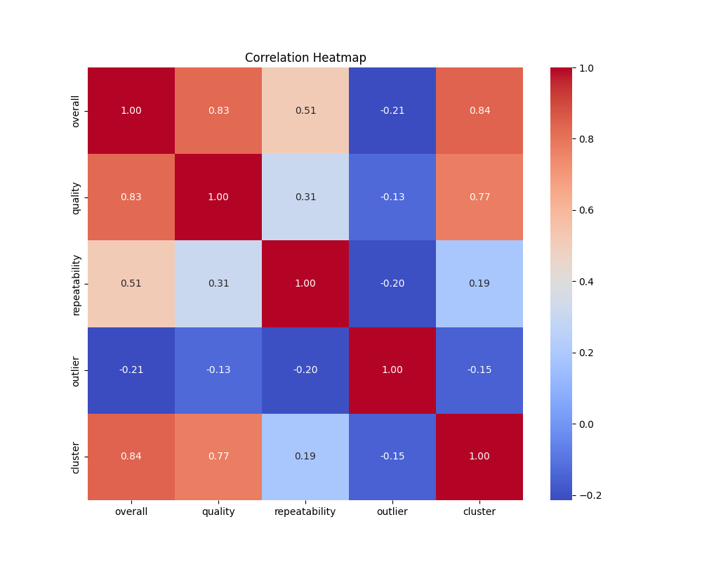
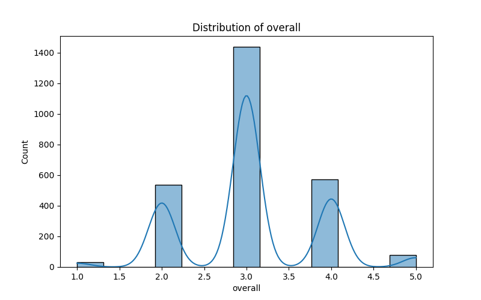
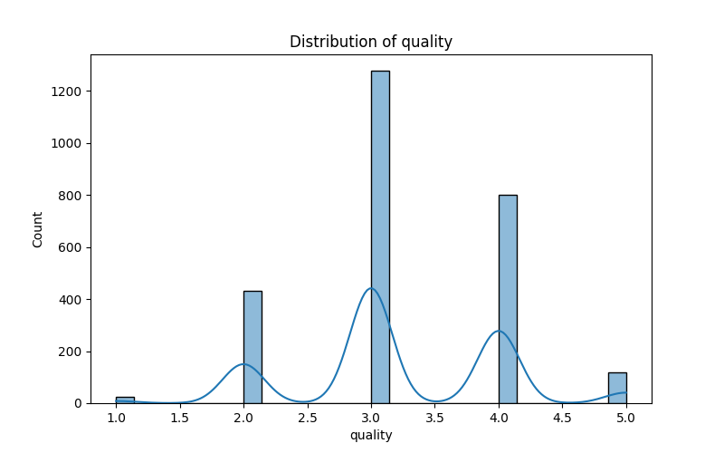
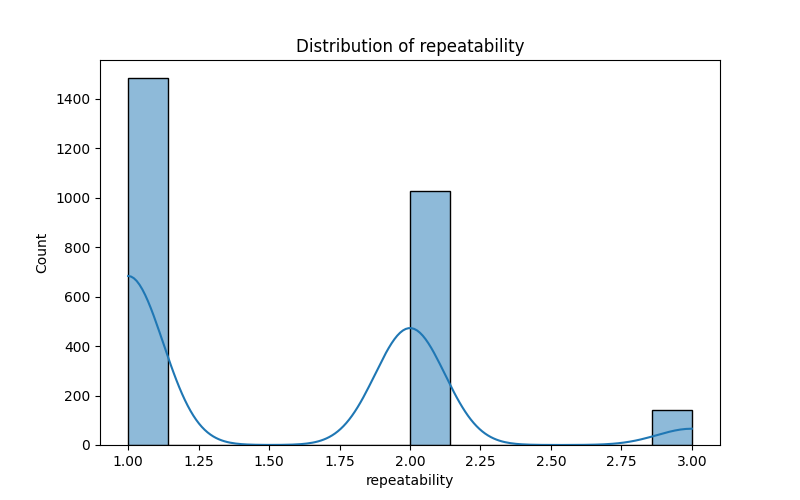
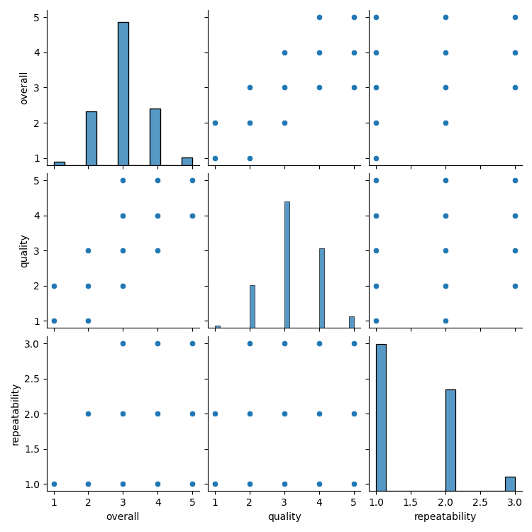
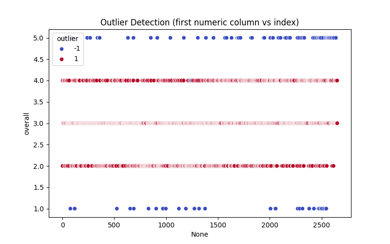
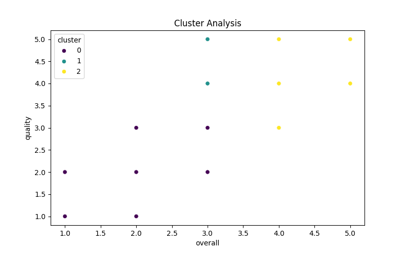

# Automated Data Analysis Report

## Data Overview

- Number of rows: 2652
- Number of columns: 3
- Column names and data types:

  - overall: float64
  - quality: float64
  - repeatability: float64

## Summary Statistics

### overall
- count: 2652.0
- mean: 3.0475113122171944
- std: 0.762179758096274
- min: 1.0
- 25%: 3.0
- 50%: 3.0
- 75%: 3.0
- max: 5.0
### quality
- count: 2652.0
- mean: 3.2092760180995477
- std: 0.7967426636666768
- min: 1.0
- 25%: 3.0
- 50%: 3.0
- 75%: 4.0
- max: 5.0
### repeatability
- count: 2652.0
- mean: 1.4947209653092006
- std: 0.5982894305802061
- min: 1.0
- 25%: 1.0
- 50%: 1.0
- 75%: 2.0
- max: 3.0

## Missing Values

- overall: 0 missing values
- quality: 0 missing values
- repeatability: 0 missing values

## Visualizations

